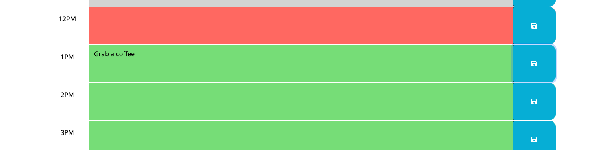
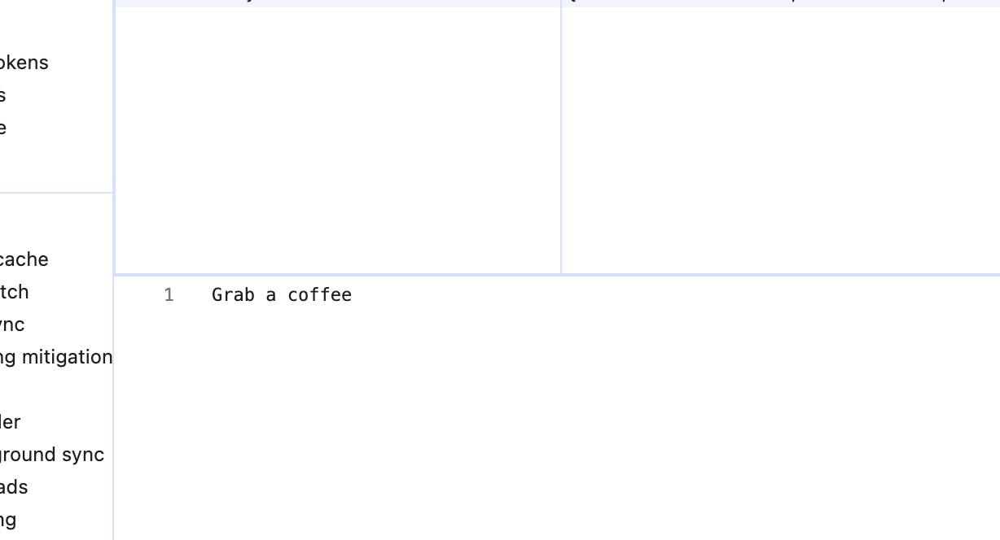
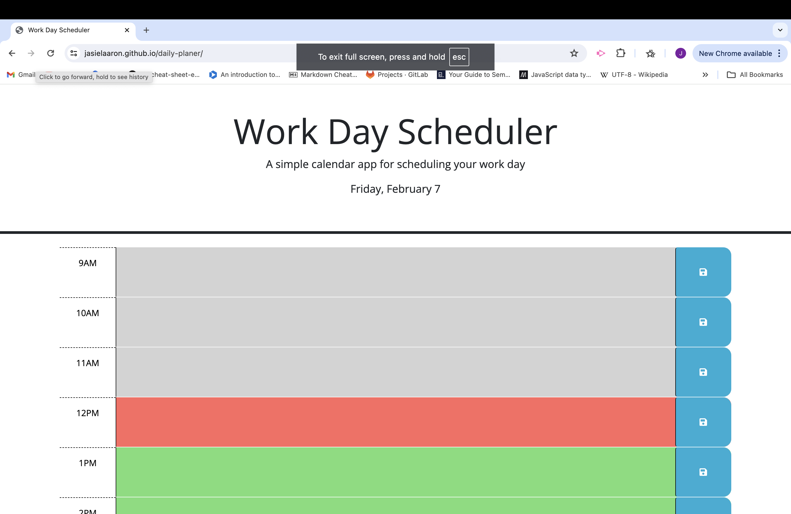

# Daily Planner

  

  ## Description

  Allows you to import events to a daily planner save events and keep track of a busy schedule.

  ## Deployed Application URL
  
  https://jasielaaron.github.io/daily-planer/

  ## Screenshot
  
  
  

  ## Table of Contents

  * [Languages & Dependecies](#languagesanddependencies)
  * [Usage](#usage)
  * [Sources](#sources)
  * [Questions](#questions)  

  ## Languages & Dependecies
  JavaScript, HTML, CSS
  JQuery elements, dajs(), third parties APIs 
  ## Sources 

  JQuery documentation 
  dayjs documenatation

  
  ## Questions 

  Further questions send them [jasiel.7@icloud.com](mailto:jasiel.7@icloud.com?subject=[GitHub%20Dev20Connect])
